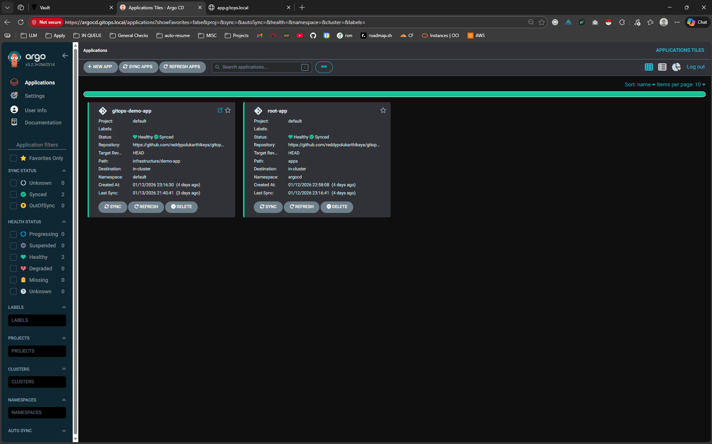
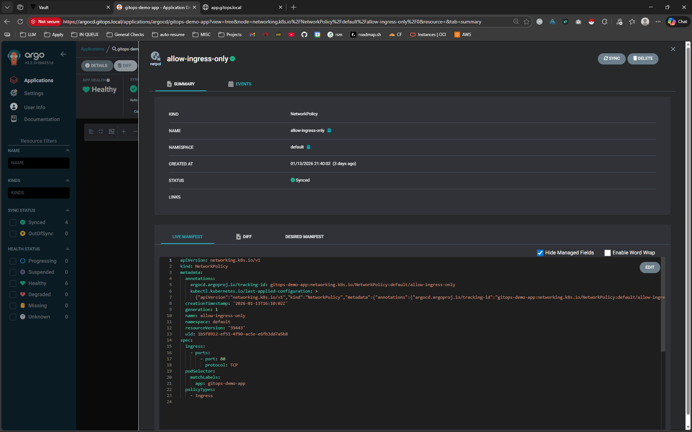
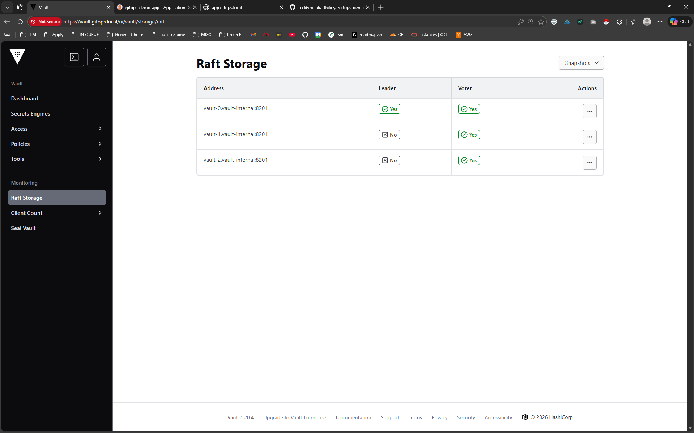

# 🚀 The "GitOps" Production Pipeline
### Enterprise-Grade Kubernetes Architecture on Local Hardware


---

## 📖 Project Overview

This project demonstrates a full migration from a manual Docker Compose setup to a **production-grade Kubernetes environment**. It implements the **GitOps** methodology, ensuring that "Git is the Source of Truth" for both infrastructure and application state.

The core goal was to eliminate "Security Sprawl" and manual deployments by building a pipeline where:

1. **Infrastructure is Immutable:** Managed via Helm and Git.
2. **Secrets are Centralized:** Stored in HashiCorp Vault, never in Git.
3. **Deployment is Automated:** Pull-based GitOps via ArgoCD.
4. **Supply Chain is Secure:** Images are scanned with Trivy before deployment.

### 📂 Source Code
* **Demo Application:** [reddypolukarthikeya/gitops-demo-app](https://github.com/reddypolukarthikeya/gitops-demo-app)
* **Infrastructure:** *(This Repository)*
---

## 🏗️ Architecture: The "Zero Trust" Workflow

1. **Code Commit:** Developer pushes code to GitHub.
2. **CI Pipeline:** GitHub Actions builds the image and scans for CVEs (**Trivy**).
3. **Git Write-Back:** Upon success, the CI bot updates the Helm manifest in the Infrastructure Repo with the new specific Commit SHA.
4. **Sync:** **ArgoCD** detects the change and syncs the cluster state.
5. **Secret Injection:** **External Secrets Operator (ESO)** fetches credentials from **Vault** and injects them into pods at runtime.
6. **Hardening:** **Network Policies** block unauthorized traffic, and **Ingress** manages TLS termination.

---

## 🛠️ Tech Stack

| Component | Tool | Description |
|:---|:---|:---|
| **Orchestrator** | **K3s** | Lightweight Kubernetes on Ubuntu Server (VirtualBox). |
| **GitOps Engine** | **ArgoCD** | Continuous Delivery using the Pull Model. |
| **Secret Mgmt** | **HashiCorp Vault** | HA Cluster (Raft Storage) + Auto-Unseal. |
| **Secret Bridge** | **External Secrets (ESO)** | Syncs Vault secrets to K8s Secrets securely. |
| **CI Pipeline** | **GitHub Actions** | Build, Test, and "Git Write-Back" logic. |
| **Security** | **Trivy** | Container image vulnerability scanning. |
| **Networking** | **MetalLB & NGINX** | Load Balancing and Ingress Controller. |
| **TLS/SSL** | **Cert-Manager** | Automated Certificate Management (Self-Signed CA). |

---

## ✨ Key Features & Engineering Wins

### 🔐 1. The "Secret Zero" Solution

- **Problem:** Storing Kubernetes `Secret` manifests in Git is insecure.
- **Solution:** Integrated **HashiCorp Vault** with **External Secrets Operator**. Git only contains *references* (`ExternalSecret`); the actual sensitive data lives in the encrypted Vault and is injected at runtime.

### 🔄 2. Self-Healing GitOps Loop

- Implemented the **App-of-Apps** pattern in ArgoCD to manage the entire cluster configuration from a single entry point.
- **Drift Detection:** Ensures that manual changes (`kubectl edit`) are immediately overwritten by the state defined in Git.

### 🛡️ 3. Hardened Security

- **Network Policies:** Implemented a "Deny-All" default firewall, whitelisting only Ingress traffic on Port 80.
- **Audit Logging:** Enabled robust audit trails in Vault to track every access request (Configured on HA Leader).
- **Supply Chain Security:** CI pipeline blocks builds if Critical vulnerabilities are found by Trivy.

### 🤖 4. The "Git Write-Back" Pattern

- Instead of using the unstable `latest` tag, the CI pipeline automatically commits the specific **Commit SHA** to the `deployment.yaml`.
- This provides a perfect audit trail of exactly *which* version of code is running in production and prevents "it works on my machine" issues.

---

## 🚀 Installation


### Phase 1: Infrastructure Foundation

Setting up the bare-metal-like environment.
```bash
# Install K3s (Traefik disabled)
curl -sfL https://get.k3s.io | INSTALL_K3S_EXEC="--disable traefik" sh -

# Install MetalLB & NGINX Ingress
kubectl apply -f infrastructure/networking/
```

### Phase 2: Security Core

Implementing the centralized secret store.
```bash
# Deploy Vault (HA Mode)
helm install vault hashicorp/vault -n vault -f infrastructure/security/vault-values.yaml

# Initialize & Unseal
kubectl exec -ti vault-0 -n vault -- vault operator init
```

### Phase 3: The GitOps Engine

Connecting the cluster to the source of truth.
```bash
# Deploy ArgoCD
kubectl apply -n argocd -f https://raw.githubusercontent.com/argoproj/argo-cd/stable/manifests/install.yaml

# Apply App of Apps
kubectl apply -f infrastructure/argocd/root-app.yaml
```

---

## 📸 Screenshots

### ArgoCD Dashboard (Sync Status)

*The application is fully synced with Git and healthy.*

### Network Policy Hardening

*ArgoCD visualizes the active firewall rules protecting the application.*

### Vault High Availability (Raft Storage)

*A 3-node Vault cluster using Raft integrated storage for automatic leader election and failover.*

---

## 🔮 Future Improvements

- [ ] **Vault Auto-Unseal:** Configure AWS KMS to automatically unseal Vault in case of restarts, eliminating manual internvention.
- [ ] **Observability:** Add Prometheus & Grafana stack for metrics and alerting.
- [ ] **Testing:** Implement unit tests (npm test) in the CI pipeline to prevent functional regressions.
- [ ] **Branch Protection:** Enforce Pull Request workflows for infrastructure changes.
